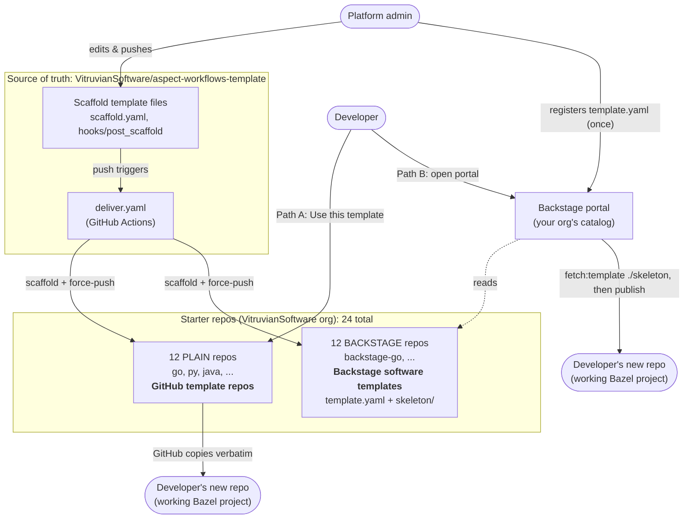
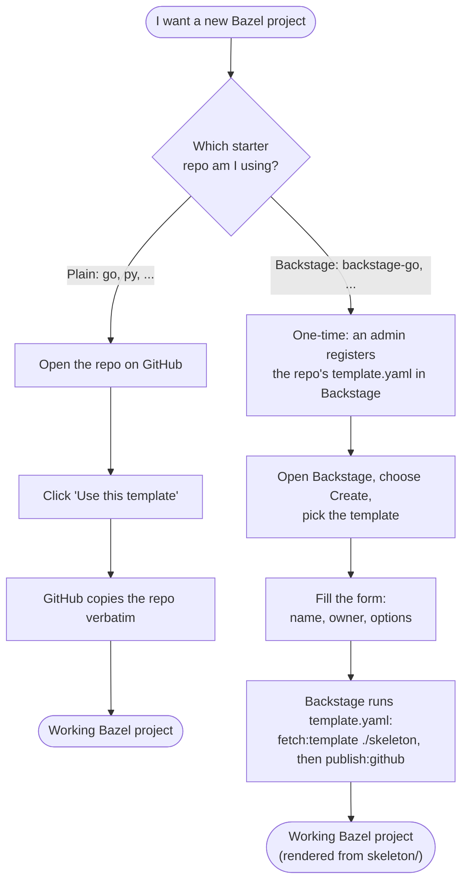
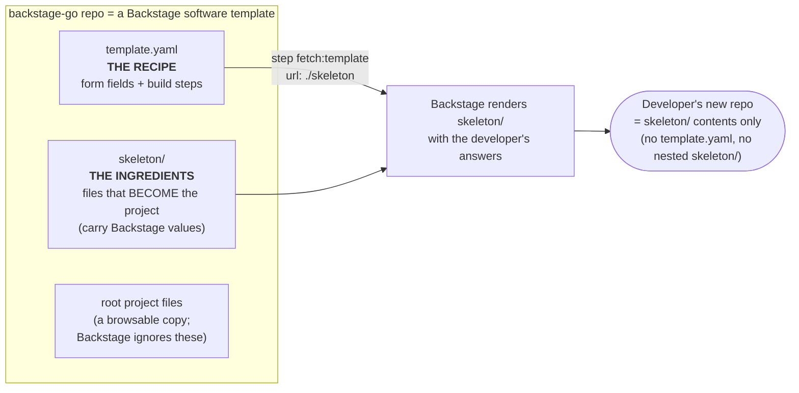
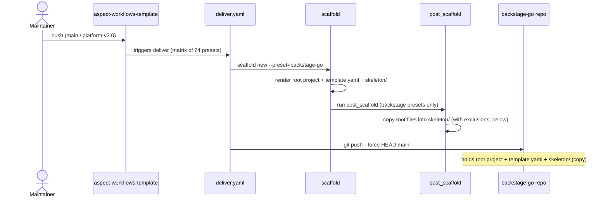

# Backstage Integration Guide

This guide explains how the Aspect Workflows template generator supports **both** direct project generation and Backstage software template generation.

## Overview

The template generator operates in two modes:

1. **Direct Generation Mode** (default): Generates ready-to-use Bazel monorepo projects
2. **Backstage Template Mode**: Generates Backstage software templates that can be registered in Backstage's catalog

> **Important**: All commands in this guide use `SCAFFOLD_SETTINGS_RUN_HOOKS=always` to ensure post-generation hooks run. These hooks are essential for copying files into the `skeleton/` directory for Backstage templates.

## Visual Overview

### The big picture (container view)

One source repo feeds an automated pipeline that publishes **24 starter repos** in two flavors, which developers consume in two different ways:



### Two ways a developer gets a project

The single most important thing to understand: **plain** starter repos and **backstage** starter repos are consumed through completely different mechanisms.



| | Plain repos (`go`, `py`, …) | Backstage repos (`backstage-go`, …) |
|---|---|---|
| **Mechanism** | GitHub "Use this template" | Backstage software template |
| **Setup needed** | none — just click | admin registers `template.yaml` once |
| **What gets copied** | the whole repo, verbatim | only `skeleton/`, rendered with your answers |
| **Developer ends up with** | working project | working project |

> Both paths produce a working project. The difference is the *delivery mechanism* — and it's why the backstage repos carry the extra `template.yaml` + `skeleton/` (explained below).

## Quick Start

### Direct Generation (Traditional Workflow)

Generate a ready-to-use project:

```bash
# Interactive mode
SCAFFOLD_SETTINGS_RUN_HOOKS=always scaffold new .

# With preset
SCAFFOLD_SETTINGS_RUN_HOOKS=always scaffold new --preset=py --output-dir=my-python-project .
```

Result: A complete, runnable Bazel monorepo in `my-python-project/`

### Backstage Template Generation

Generate a Backstage template:

```bash
# Interactive mode - answer "yes" to "Generate as a Backstage template?"
SCAFFOLD_SETTINGS_RUN_HOOKS=always scaffold new --output-dir=backstage-templates/aspect-python .

# With backstage preset
SCAFFOLD_SETTINGS_RUN_HOOKS=always scaffold new --preset=backstage-py --output-dir=backstage-templates/aspect-python .
```

Result: A Backstage template structure ready to be published and registered

## Architecture Comparison

### Direct Generation Mode
```
my-python-project/
├── catalog-info.yaml       # Component (for the generated project)
├── .bazelrc
├── BUILD
├── MODULE.bazel
├── pyproject.toml
├── requirements/
├── tools/
└── ... (all project files)
```

### Backstage Template Mode
```
backstage-templates/aspect-python/
├── catalog-info.yaml       # Location (points to template.yaml)
├── template.yaml           # Scaffolder definition
└── skeleton/               # The actual code to scaffold
    ├── catalog-info.yaml   # Component (for generated projects)
    ├── .bazelrc
    ├── BUILD
    ├── MODULE.bazel
    ├── pyproject.toml
    └── ... (copied files + Backstage-specific files)
```

## Key Differences

| Aspect | Direct Generation | Backstage Template |
|--------|------------------|-------------------|
| **Output** | Runnable project | Template definition |
| **Variables** | Scaffold syntax (`{{ .ProjectSnake }}`) | Backstage syntax (`${{ values.name }}`) |
| **Usage** | Immediate development | Registered in Backstage catalog |
| **catalog-info.yaml** | Kind: Component | Kind: Location |
| **Additional Files** | None | `template.yaml`, `skeleton/` |

## Available Presets

### Direct Generation Presets
- `kitchen-sink` - All languages and features
- `py` - Python only
- `js` - JavaScript/TypeScript only
- `go` - Go only
- `java`, `kotlin`, `cpp`, `rust`, `ruby`, `scala`, `shell` - Language-specific
- `minimal` - Bare bones Bazel setup

### Backstage Template Presets
- `backstage-kitchen-sink` - All languages (as Backstage template)
- `backstage-py` - Python template
- `backstage-js` - JavaScript/TypeScript template
- `backstage-go` - Go template
- `backstage-java` - Java template
- `backstage-kotlin` - Kotlin template
- `backstage-cpp` - C++ template
- `backstage-rust` - Rust template
- `backstage-ruby` - Ruby template
- `backstage-scala` - Scala template
- `backstage-shell` - Shell template
- `backstage-minimal` - Bare bones template

## Detailed Workflows

### Workflow 1: Direct Generation (No Backstage)

**Use Case**: Quickly create a new project for immediate development

```bash
# Create a Python project
scaffold new --preset=py --output-dir=my-service .
cd my-service

# Start developing
bazel run //tools:bazel_env
bazel test //...
```

**Generated `catalog-info.yaml`**:
```yaml
apiVersion: backstage.io/v1alpha1
kind: Component
metadata:
  name: python-generated-project
  description: Bazel project using Aspect Workflows
spec:
  type: service
  owner: team-platform
```

### Workflow 2: Backstage Template Generation

**Use Case**: Create a reusable template for your organization

```bash
# Generate Backstage template
scaffold new --preset=backstage-py --output-dir=templates/aspect-python .
cd templates/aspect-python

# Verify structure
ls -la
# catalog-info.yaml
# template.yaml
# skeleton/ (with copied files)

# Publish to GitHub
git init
git add .
git commit -m "Add Aspect Python template"
git remote add origin https://github.com/YOUR-ORG/aspect-python-template.git
git push -u origin main
```

**Generated `catalog-info.yaml`**:
```yaml
apiVersion: scaffolder.backstage.io/v1beta3
kind: Location
metadata:
  name: aspect-workflows-templates
spec:
  type: url
  targets:
    - ./template.yaml
```

### Workflow 3: Using Backstage Template

**Use Case**: Developers create projects through Backstage UI

1. Register template in Backstage:
   ```yaml
   # app-config.yaml
   catalog:
     locations:
       - type: url
         target: https://github.com/YOUR-ORG/aspect-python-template/blob/main/catalog-info.yaml
   ```

2. Developer clicks "Create" in Backstage
3. Selects "Aspect Workflows - Python"
4. Fills form:
   - Name: `payment-service`
   - Owner: `platform-team`
   - Features: Enable linting ✓, Enable OCI ✓
5. Clicks "Create"

Backstage creates `https://github.com/YOUR-ORG/payment-service` with full Bazel setup

## Understanding the Skeleton Directory

`template.yaml` and `skeleton/` exist **only in Backstage mode**, and they map onto Backstage's "recipe vs. ingredients" model:



Because Backstage's `fetch:template` step reads **only** `./skeleton`, that directory must be a complete copy of the project. That copy is built automatically by the delivery pipeline:



This is why a `backstage-*` repo contains the project **twice** — once at the root (browsable) and once under `skeleton/` (what Backstage actually scaffolds from). A plain repo has neither `template.yaml` nor `skeleton/`; it *is* the project.

Inside a backstage repo, the `skeleton/` directory contains **copies** of project files:

```bash
skeleton/
├── catalog-info.yaml          # Unique (uses ${{ values.* }})
├── .bazelrc
├── BUILD
├── MODULE.bazel
├── tools/
└── ...
```

### How It Works

1. **Post-generation hook** (`hooks/post_scaffold`): copies the rendered project files from the repo root into `skeleton/`. Real copies are used, not symlinks, because Backstage's scaffolder does not follow symlinks.
2. **Exclusions**: these files are deliberately *not* copied into `skeleton/`: `template.yaml`, the root `catalog-info.yaml`, the `skeleton/` directory itself, `README.md`, and `README.bazel.md`.
3. **Backstage variables**: files kept inside `skeleton/` use Backstage `${{ values.* }}` substitution (rendered when a developer runs the template), not Scaffold `{{ .X }}` syntax.

### Files That Are Skeleton-Specific

- `skeleton/catalog-info.yaml` — the generated project's catalog entry, using Backstage `${{ values.* }}` variables (the root `catalog-info.yaml` is a `kind: Location` that points Backstage at `template.yaml`, so it is excluded from the copy).
- `skeleton/README.md` — a skeleton-specific readme (the root `README.md` and `README.bazel.md` are excluded from the copy).

## Configuration Reference

### scaffold.yaml Questions

```yaml
questions:
  - name: backstage
    prompt:
      confirm: Generate as a Backstage template?
      description: Creates a Backstage software template...
```

**When `backstage: true`**:
- Creates `template.yaml`
- Creates `skeleton/` directory with copied files
- Changes `catalog-info.yaml` from Component to Location

**When `backstage: false`** (default):
- Generates project directly
- No `template.yaml` or `skeleton/`
- `catalog-info.yaml` is Component

### template.yaml Parameters

Edit the generated `template.yaml` to customize questions:

```yaml
spec:
  parameters:
    - title: Project Information
      required: [name, owner]
      properties:
        name:
          title: Project Name
          type: string
          pattern: '^[a-z0-9-]+$'
        
        # Add custom parameters
        environment:
          title: Environment
          type: string
          enum: [dev, staging, prod]
```

## Customization Examples

### Example 1: Add a Database Selection

Edit `template.yaml`:

```yaml
parameters:
  - title: Database
    properties:
      database:
        title: Choose Database
        type: string
        enum:
          - postgresql
          - mysql
          - mongodb
        default: postgresql
```

Then in `skeleton/` files, use:
```yaml
# skeleton/config.yaml
database:
  type: ${{ values.database }}
```

### Example 2: Conditional Features

Use Nunjucks in skeleton files:

```python
# skeleton/main.py

from prometheus_client import Counter
request_counter = Counter('requests', 'Request count')


def main():
    
    request_counter.inc()
    
    print("Hello, ${{ values.name }}!")
```

### Example 3: Multi-Repo Template

Create separate templates for different use cases:

```bash
# Microservice template
scaffold new --preset=backstage-py --output-dir=templates/microservice .

# Data pipeline template  
scaffold new --preset=backstage-py --output-dir=templates/data-pipeline .

# CLI tool template
scaffold new --preset=backstage-go --output-dir=templates/cli-tool .
```

Each gets different `template.yaml` configuration and parameters.

## Testing and Validation

### Local Testing (Without Backstage)

```bash
# Generate template
scaffold new --preset=backstage-py --output-dir=/tmp/test-template .

# Inspect structure
cd /tmp/test-template
tree -L 2

# Verify skeleton files
ls -la skeleton/

# Check template.yaml syntax
cat template.yaml | yq eval
```

### Testing in Backstage

1. **Use Template Editor**:
   ```bash
   backstage-cli templates:preview --file ./template.yaml
   ```

2. **Register Locally**:
   ```yaml
   # app-config.local.yaml
   catalog:
     locations:
       - type: file
         target: /path/to/template.yaml
   ```

3. **Create Test Project**: Use Backstage UI to create a project

4. **Verify Generated Project**:
   ```bash
   cd ~/generated-test-project
   bazel test //...
   ```

## Migration Strategies

### Strategy 1: Gradual Migration

1. Keep existing direct generation working
2. Add Backstage templates in parallel
3. Teams adopt Backstage over time

```bash
# Team A: Still uses direct generation
scaffold new --preset=py --output-dir=team-a-service .

# Team B: Uses Backstage
# (uses template from Backstage UI)
```

### Strategy 2: Backstage-First

1. Generate all templates as Backstage templates
2. Mandate template usage through Backstage
3. Direct generation only for testing

```bash
# Generate all presets as Backstage templates
for preset in py js go java kotlin; do
  scaffold new --preset=backstage-$preset \
    --output-dir=templates/aspect-$preset .
done
```

## Troubleshooting

### Template Not Appearing in Backstage

**Symptoms**: Template doesn't show in "Create" menu

**Solutions**:
1. Check catalog processing logs
2. Verify `catalog-info.yaml` Kind is `Location`
3. Ensure `template.yaml` path is correct
4. Check repository is public or Backstage has access

### Skeleton Files Missing

**Symptoms**: `skeleton/` directory empty or files missing

**Solutions**:
1. Ensure hooks are enabled: `SCAFFOLD_SETTINGS_RUN_HOOKS=always`
2. Re-generate with hooks enabled
3. Check if Git LFS is required for large files

### Variables Not Replaced

**Symptoms**: Generated project has `${{ values.name }}` literally

**Solutions**:
1. Verify Backstage template engine is processing files
2. Check `template.yaml` → `fetch:template` step
3. Ensure file extensions are recognized (add to `replace` list if needed)
4. Check for double-escaping (`${{{{ values.name }}}}`)

### Generated Project Missing Features

**Symptoms**: Linting or OCI features not included despite being selected

**Solutions**:
1. Check parameter names match in `template.yaml` and conditions
2. Verify conditional logic in `template.yaml` steps
3. Ensure `values.enableLinting` passed to `fetch:template` input
4. Check scaffold.yaml features aren't conflicting

## Best Practices

### 1. Template Naming

```yaml
# Good: Descriptive and organization-specific
name: acme-microservice-python
title: ACME Python Microservice Template

# Avoid: Generic names
name: python-template
```

### 2. Parameter Validation

```yaml
properties:
  name:
    pattern: '^[a-z][a-z0-9-]*$'  # Enforce naming convention
    minLength: 3
    maxLength: 50
  owner:
    ui:field: OwnerPicker  # Use Backstage pickers
```

### 3. Documentation in Templates

```yaml
# template.yaml
properties:
  enableOCI:
    title: Enable OCI Containers
    description: |
      Adds rules_oci for building container images.
      Requires: Docker daemon, artifact registry access.
      See: https://docs.aspect.build/oci
```

### 4. Version Control

```
templates/
├── aspect-python/
│   └── template.yaml  # v1.0.0
├── aspect-python-v2/
│   └── template.yaml  # v2.0.0 (breaking changes)
└── README.md          # Changelog
```

### 5. Template Maintenance

- **Pin tool versions** in MODULE.bazel
- **Document breaking changes** in template description
- **Test after Backstage upgrades**
- **Use semantic versioning** in template metadata

## Resources

- [Backstage Software Templates Docs](https://backstage.io/docs/features/software-templates/)
- [Backstage Template Actions](https://backstage.io/docs/features/software-templates/builtin-actions)
- [Aspect Workflows Docs](https://docs.aspect.build/)
- [Scaffold Documentation](https://hay-kot.github.io/scaffold/)

## Support

- Bazel Slack: #aspect-build channel
- GitHub Issues: https://github.com/VitruvianSoftware/aspect-workflows-template/issues
- Backstage Discord: https://discord.gg/backstage
