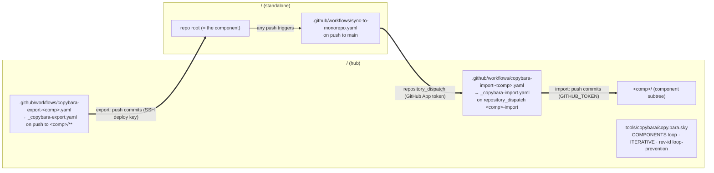
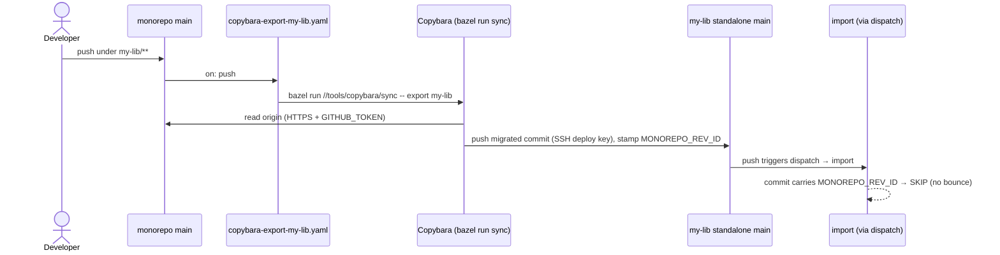
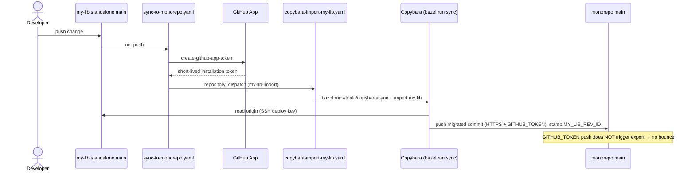
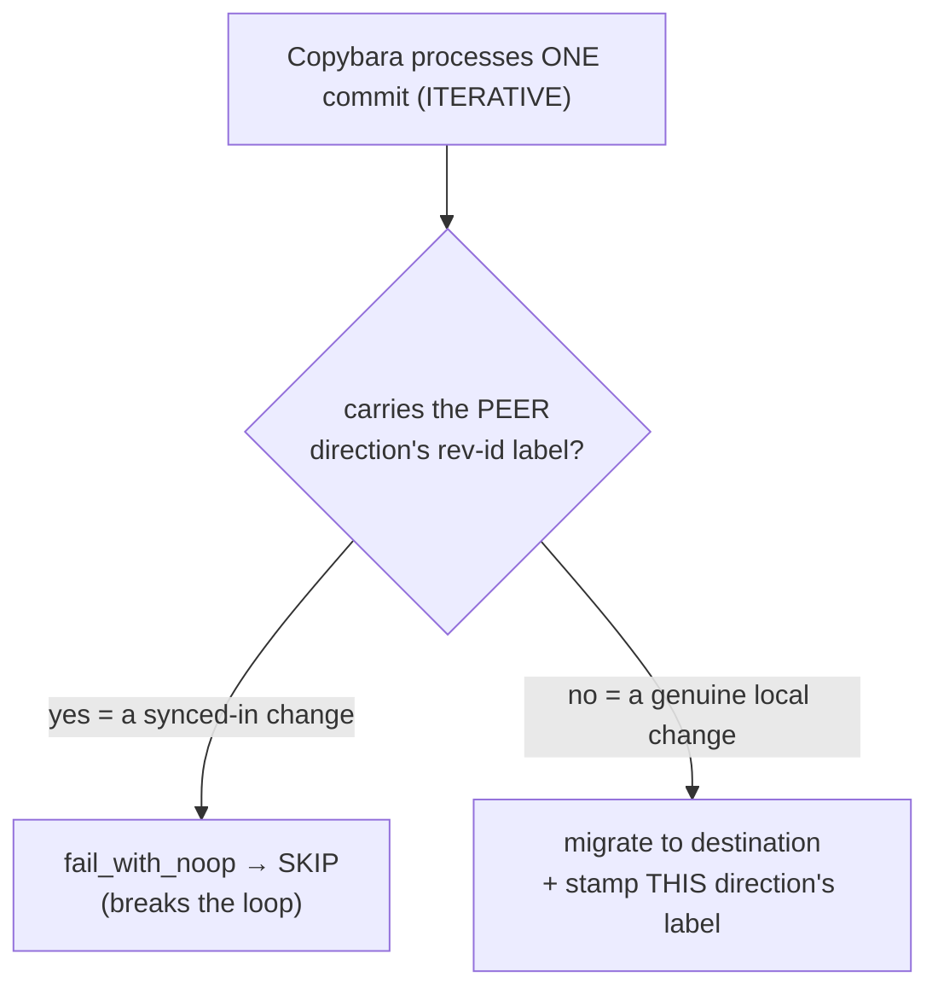
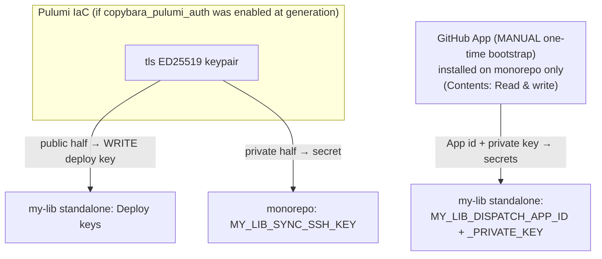
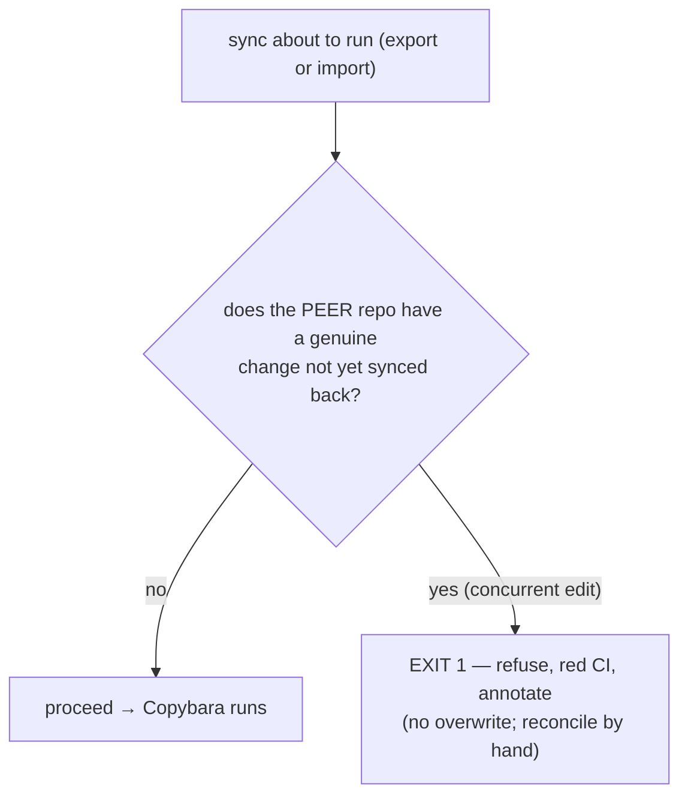

# Copybara Bidirectional Sync — Admin Runbook

**Scope:** how the bidirectional sync between each `<monorepo>/<component>/` subtree and its
standalone `github.com/<your-org>/<component>` repo works, how to operate and maintain it, and
what to watch out for. The mechanism is identical per component; the Copybara config is one
parameterized loop and the CI workflows are two reusable workflows with thin per-component callers.

> [!WARNING]
> **Conflict handling is NOT fail-loud.** If the *same line* is edited on **both** repos before a
> sync cycle completes, the two repos **silently diverge** — both syncs run green and end up holding
> opposite values, with no error. See [§7 Conflicts](#7-conflicts--the-one-thing-to-watch). Normal
> (non-concurrent) edits sync correctly with no bounce.

---

## 1. TL;DR

- **Bidirectional, on-push, near-real-time.** A push under `<monorepo>/<component>/**` is exported
  to that standalone repo; a push to a standalone repo is imported back under `<component>/`.
- **Centralized hub.** All sync logic (the Copybara config + the reusable sync workflows) lives in
  **this monorepo**. Each standalone repo carries exactly one tiny workflow that fires a
  `repository_dispatch`.
- **One config, N components.** `tools/copybara/copy.bara.sky` generates
  `export_<comp>`/`import_<comp>` for every component from a `COMPONENTS` list; CI uses two
  reusable workflows + per-component callers.
- **No bounce.** Per-direction rev-id labels + a per-commit skip-guard stop an exported change from
  bouncing back as an import (and vice-versa).
- **Auth is IaC** (optional). A write SSH deploy key + a GitHub App, provisionable by Pulumi if you
  enabled `copybara_pulumi_auth` at generation time; otherwise provisioned manually.

---

## 2. Architecture at a glance

Per component (`<comp>` ∈ the `COMPONENTS` list in `tools/copybara/copy.bara.sky`):



> §3–§4 below walk the flow using a worked example component `my-lib`; every component behaves
> identically (substitute `<comp>` and its `<COMP>_*` secrets / `<COMP>_REV_ID` label).

### Moving parts

| File | Repo | Purpose |
|---|---|---|
| `tools/copybara/copy.bara.sky` | monorepo | The Copybara config. A `COMPONENTS` list drives a function that generates `export_<comp>`/`import_<comp>` for every component: `ITERATIVE` mode, rev-id labels, skip-guards, path `core.move`, `**/BUILD` + context-file excludes. |
| `.github/workflows/_copybara-export.yaml` | monorepo | **Reusable** (`workflow_call`). All export logic + the Copybara run-target call, parameterized by `component` / `standalone_only` / `sync_ssh_key`. |
| `.github/workflows/_copybara-import.yaml` | monorepo | **Reusable.** All import logic (incl. the push-race retry handled inside the `sync` binary). |
| `.github/workflows/copybara-export-<comp>.yaml` | monorepo | Thin caller (one per component). Owns the `push` path trigger (`<comp>/**`) + per-component concurrency group; calls the export reusable. |
| `.github/workflows/copybara-import-<comp>.yaml` | monorepo | Thin caller (one per component). Owns the `repository_dispatch` trigger (type `<comp>-import`) + per-component concurrency; calls the import reusable. |
| `.github/workflows/copybara-drift-check.yaml` | monorepo | Loops all components, diffs each subtree against its standalone (gated on whether the component is seeded). |
| `tools/copybara/conflict_precheck` | monorepo | `bazel run //tools/copybara/conflict_precheck` — component-aware pre-push conflict guard (called by both reusables). |
| `tools/copybara/sync` | monorepo | `bazel run //tools/copybara/sync -- <export\|import> <component>` — the main sync driver. |
| `tools/copybara/drift_check` | monorepo | `bazel run //tools/copybara/drift_check -- --org <org> <workspace> <comp…>` — standalone drift detector. |
| `.github/workflows/sync-to-monorepo.yaml` | **each standalone** | On push to main, mints a GitHub App token and fires a `repository_dispatch` into the monorepo. The only sync machinery a standalone carries. Template at `tools/copybara/sync-to-monorepo.yaml` in this repo (see §8f). |
| `infrastructure/.../copybara_sync/` | monorepo (optional) | Pulumi IaC: loops components, provisioning each component's deploy key + three Actions secrets. Only present if `copybara_pulumi_auth` was enabled at generation. |

### Versions / identifiers (pinned)

| Thing | Value |
|---|---|
| Copybara image | `olivr/copybara@sha256:87e2e9089344e64693faebb2ee0ed33b8797358c0420b0fa98325ca611e98679` (2023-01 build, reports "Unknown version") |
| Dispatch token action | `actions/create-github-app-token@bcd2ba49218906704ab6c1aa796996da409d3eb1` (v3.2.0) |
| Export-push secret | `<COMP>_SYNC_SSH_KEY` (in monorepo) ↔ write deploy key on the standalone. |
| Dispatch secrets | `<COMP>_DISPATCH_APP_ID`, `<COMP>_DISPATCH_APP_PRIVATE_KEY` (in each standalone). |
| Rev-id labels | export stamps `MONOREPO_REV_ID` (shared — each lands on a *separate* standalone); import stamps a per-component `<COMP>_REV_ID` (unique — they all land in the *shared* monorepo). |

---

## 3. How the EXPORT flow works (monorepo → standalone)

**Trigger:** a push to monorepo `main` touching `my-lib/**`.

1. `copybara-export-my-lib.yaml` fires (`on: push`, `paths: my-lib/**`).
2. It writes auth to the runner: the deploy key → `~/.ssh/id_rsa` (with a guaranteed trailing
   newline), and `GITHUB_TOKEN` → `~/.git-credentials`.
3. It runs `bazel run //tools/copybara/sync -- export my-lib`.
4. Copybara **reads** the monorepo over **HTTPS** (`GITHUB_TOKEN`), strips the `my-lib/` prefix
   (`core.move`), and **pushes** the migrated commit(s) to the standalone over **SSH** (deploy key),
   stamping each with `MONOREPO_REV_ID`.
5. That push to the standalone `main` triggers `sync-to-monorepo.yaml` → a `repository_dispatch` →
   the import. The import sees the `MONOREPO_REV_ID` label and **skip-guards** it (no bounce).



---

## 4. How the IMPORT flow works (standalone → monorepo)

**Trigger:** a push to the standalone `my-lib` `main`.

1. `sync-to-monorepo.yaml` (in the standalone) fires `on: push`.
2. It mints a short-lived token from the **GitHub App** (`create-github-app-token`, using the
   `MY_LIB_DISPATCH_APP_*` secrets) and `POST`s a `repository_dispatch` (`event_type:
   my-lib-import`) to the monorepo. *(The App is needed because the standalone's own
   `GITHUB_TOKEN` can't reach the monorepo.)*
3. `copybara-import-my-lib.yaml` fires on that dispatch, sets up the same auth, and runs
   `bazel run //tools/copybara/sync -- import my-lib`.
4. Copybara **reads** the standalone over **SSH** (deploy key), adds the `my-lib/` prefix, and
   **pushes** to monorepo `main` over **HTTPS** (`GITHUB_TOKEN`, needs `contents: write`),
   stamping each commit with `MY_LIB_REV_ID`.
5. That push is made by `GITHUB_TOKEN`, which **does not trigger workflows** — so the export is not
   re-triggered. (The skip-guard would also catch it; this is belt-and-suspenders.)



---

## 5. How loop-prevention works (and why `ITERATIVE` is mandatory)

Two cooperating mechanisms, **both required**:

1. **Per-direction rev-id labels.** Export stamps `MONOREPO_REV_ID`; import stamps `MY_LIB_REV_ID`
   (via `experimental_custom_rev_id`). A change's label tells you which side it originated on.
2. **A per-commit skip-guard** (`core.dynamic_transform` → `core.fail_with_noop`): if a commit
   carries the *other* direction's label, drop it instead of migrating it back.



> [!IMPORTANT]
> **Use `ITERATIVE`, never `SQUASH`.** In SQUASH mode the skip-guard sees the labels of the *whole
> squashed range*, so a range that merely **contains** one peer-origin commit is skipped **entirely**
> — including genuine changes batched with it. Because an import lands on monorepo `main` via
> `GITHUB_TOKEN` (which doesn't advance the export baseline), the next export range includes that
> import commit, and SQUASH would skip the genuine change too — **the export direction gets stuck.**
> `ITERATIVE` evaluates the guard per commit, so only peer commits are skipped.

---

## 6. Auth & secrets (all IaC except the App bootstrap)



- **Export push** (monorepo → standalone): the **write deploy key** on the standalone. Private half
  is `<COMP>_SYNC_SSH_KEY` in the monorepo.
- **Reading monorepo / writing it on import:** the workflow's `GITHUB_TOKEN` over HTTPS.
- **The dispatch** (standalone → monorepo): the **GitHub App**. The App is installed on
  the monorepo only (least-privilege; `repository_dispatch` needs Contents: write there). Its
  credentials live as secrets in the standalone.
- **Provisioned by Pulumi** (if `copybara_pulumi_auth` was enabled): per component, the deploy key
  + three secrets — it loops `syncedProjects` in `infrastructure/.../copybara_sync/`. The App
  itself is created/installed by hand (GitHub has no headless App-creation API); Pulumi only places
  its credentials, supplied as stack config secrets.
- **Manual provisioning** (if Pulumi IaC was not enabled):
  1. Generate an ED25519 keypair: `ssh-keygen -t ed25519 -f deploy_key -N ""`.
  2. Add `deploy_key.pub` as a **write** deploy key on the standalone repo (GitHub → Settings →
     Deploy keys → Add).
  3. Add `deploy_key` (private half) as secret `<COMP>_SYNC_SSH_KEY` in the monorepo.
  4. Create a GitHub App (Settings → Developer settings → GitHub Apps), install it on the monorepo
     (Contents: Read & write), and add the App ID + private key as `<COMP>_DISPATCH_APP_ID` /
     `<COMP>_DISPATCH_APP_PRIVATE_KEY` in the standalone.

### Important setup step: set `GITHUB_ORG`

Before the sync can run, set the `GITHUB_ORG` constant in `tools/copybara/copy.bara.sky` and the
`GITHUB_ORG` env var in `.github/workflows/copybara-drift-check.yaml` to your GitHub organisation
name (e.g. `"my-org"`). These default to the placeholder `"YOUR_GITHUB_ORG"` and the sync will fail
until they are set.

---

## 7. Conflicts — THE one thing to watch

```mermaid
sequenceDiagram
    participant MR as monorepo main
    participant SA as my-lib standalone main
    Note over MR,SA: in sync; line L = "old"
    par concurrent conflicting edits
        MR->>MR: edit L="A", push (→ export)
    and
        SA->>SA: edit L="B", push (→ import)
    end
    MR-->>SA: export overwrites L → "A" (green)
    SA-->>MR: import overwrites L → "B" (green)
    Note over MR,SA: DIVERGED — monorepo="B", standalone="A", NO error
```

**What happens:** Copybara's `git.destination` makes the destination *match the origin* (a state
sync, not a 3-way merge). The rev-id labels do **loop-prevention, not conflict-detection** — nothing
checks "did the destination move out from under me since the baseline?" So two concurrent conflicting
edits each overwrite the other; the repos end up inconsistent, silently, with green CI.

**What to do today:**
- Treat the sync as **last-writer-wins**, and avoid editing the *same* file on both repos at once.
- After any suspected concurrent edit, **diff the component on both repos** (see §9) and reconcile
  by hand.

**Divergence is detected LOUD:**
[`.github/workflows/copybara-drift-check.yaml`](../.github/workflows/copybara-drift-check.yaml)
(`bazel run //tools/copybara/drift_check`) diffs `<monorepo>/<comp>/` against the standalone root
(applying the same context-file excludes) and goes **RED** with a CI error annotation if they
diverge. It runs **after every sync** (`workflow_run`), **every 30 min** (`schedule`), and **on
demand** (`gh workflow run copybara-drift-check.yaml`). So a conflict no longer corrupts silently
— you get a failing run pointing you at the diverged files; reconcile by hand.

**Conflicts are also PREVENTED:**
`bazel run //tools/copybara/conflict_precheck` runs **before** Copybara in each sync workflow. It
refuses to sync (exit 1, red, with an error annotation) when the **peer** repo has an un-synced
*genuine* change — a commit that does **not** carry the other direction's rev-id label, i.e. a real
edit not yet reflected back. Because **both** directions run the check, a true conflict fails
**both** runs and **neither overwrites** — you reconcile by hand and re-run. (A `--force` dispatch
skips the pre-check, for deliberate re-seeds.)



Recovery = reconcile the two edits by hand, then re-run the sync.

---

## 8. Routine maintenance (step by step)

### 8a. Re-run a sync manually

Every caller workflow exposes `workflow_dispatch` with a `copybara_options` input. Use the
**per-component** file name (replace `my-lib` with your component):

```bash
# Export (normal):
gh workflow run copybara-export-my-lib.yaml -R <your-org>/<monorepo> --ref main
# Import (normal):
gh workflow run copybara-import-my-lib.yaml -R <your-org>/<monorepo> --ref main
```

### 8b. Seed a fresh component baseline (first-ever sync) — the tested recipe

A brand-new destination has **no rev-id baseline**, so a normal run errors with
`Previous revision label <LABEL> could not be found … --last-rev or --init-history were not passed`.
**`--force` alone is NOT enough** — Copybara needs `--init-history`, and the baseline is anchored by
a **real migration** (a commit that touches managed paths). If the two repos are already
byte-identical the seed no-ops and stamps nothing, so seeding needs a transient diff. The tested
recipe using a throwaway marker that nets to zero:

```bash
COMP=my-lib   # the component name
# 1. Add a transient marker in the monorepo (skip CI so the export doesn't auto-fire un-seeded):
#    echo seed > $COMP/.copybara-seed ; git commit -m "seed [skip ci]" ; git push
# 2. Export seed — forces a SQUASH "Project import" commit on the standalone (anchors MONOREPO_REV_ID):
gh workflow run copybara-export-$COMP.yaml --ref main \
  -f copybara_options="--force --squash --init-history --ignore-noop"
# 3. Remove the marker ON THE STANDALONE (git rm + push). Note the export-seed "Project import" SHA.
# 4. Import seed — ITERATIVE with --last-rev = that "Project import" SHA, so the range is JUST the
#    genuine removal (do NOT use --squash here: the squash range would include the MONOREPO_REV_ID
#    "Project import" commit and the skip-guard would drop the whole squash → no baseline):
gh workflow run copybara-import-$COMP.yaml --ref main \
  -f copybara_options="--force --last-rev <export-seed-Project-import-SHA> --ignore-noop"
```

After both seeds, the marker is gone from both repos and a **normal** `--ignore-noop` run finds
the baseline and no-ops. Confirm with:
```bash
gh workflow run copybara-drift-check.yaml -R <your-org>/<monorepo>
```
It should report the component "in sync". A `--force` run always skips the conflict pre-check.

### 8c. Watch / debug a run

```bash
gh run list -R <your-org>/<monorepo> --workflow=copybara-export-my-lib.yaml --limit 5
gh run view <id> -R <your-org>/<monorepo> --log-failed
```

### 8d. Rotate the deploy key (via Pulumi, if enabled)

The key lives in Pulumi state. Changing the generated key is **ForceNew** on the deploy key, so it
rotates the keypair + updates the secret. From the `infrastructure/pulumi/` directory:

```bash
pulumi preview --stack dev   # confirm only the deploy key + secret change
pulumi up --stack dev
```

If Pulumi IaC is not enabled, generate a new keypair, update the deploy key on GitHub (standalone
Settings → Deploy keys), and update the `<COMP>_SYNC_SSH_KEY` monorepo secret manually.

### 8e. Rotate / replace the GitHub App private key

The App is a manual resource. Generate a new private key in the App's GitHub settings page, then:
- **With Pulumi:** update the stack config secret and re-apply:
  ```bash
  pulumi config set --secret myLibDispatchAppPrivateKey < new-key.pem   # never echo the key
  pulumi up --stack dev
  ```
- **Manually:** update `<COMP>_DISPATCH_APP_PRIVATE_KEY` directly in the standalone repo's secrets.

### 8f. Onboard another component (after initial generation)

The components defined at generation time are already wired up. To add a **new** component later
(the standalone repo must already exist — this setup never creates repos):

1. **Copybara config:** append a dict to `COMPONENTS` in `tools/copybara/copy.bara.sky`:
   ```python
   {"name": "my-new-lib", "standalone_rev_id": "MY_NEW_LIB_REV_ID", "standalone_only": [".github/workflows/sync-to-monorepo.yaml"]},
   ```
   Add `"package-lock.json"` to `standalone_only` for npm components. The `**/BUILD` exclude is
   automatic.

2. **CI caller workflows:** add two thin callers copying an existing pair, swapping the component
   name and secret name:

   `copybara-export-my-new-lib.yaml`:
   ```yaml
   on:
     push:
       branches: [main]
       paths: ["my-new-lib/**"]
     workflow_dispatch:
       inputs:
         copybara_options:
           description: "Copybara CLI options."
           default: "--ignore-noop"
   concurrency:
     group: copybara-export-my-new-lib
     cancel-in-progress: false
   jobs:
     export:
       uses: ./.github/workflows/_copybara-export.yaml
       with:
         component: my-new-lib
         standalone_only: ".github/workflows/sync-to-monorepo.yaml"
         copybara_options: ${{ "{{ github.event.inputs.copybara_options || '--ignore-noop' }}" }}
       secrets:
         sync_ssh_key: ${{ "{{ secrets.MY_NEW_LIB_SYNC_SSH_KEY }}" }}
   ```

   `copybara-import-my-new-lib.yaml`:
   ```yaml
   on:
     repository_dispatch:
       types: [my-new-lib-import]
     workflow_dispatch:
       inputs:
         copybara_options:
           description: "Copybara CLI options."
           default: "--ignore-noop"
   # Per-component (NOT shared) concurrency group — see §10 for why.
   concurrency:
     group: copybara-import-my-new-lib
     cancel-in-progress: false
   jobs:
     import:
       uses: ./.github/workflows/_copybara-import.yaml
       with:
         component: my-new-lib
         standalone_only: ".github/workflows/sync-to-monorepo.yaml"
         copybara_options: ${{ "{{ github.event.inputs.copybara_options || '--ignore-noop' }}" }}
       secrets:
         sync_ssh_key: ${{ "{{ secrets.MY_NEW_LIB_SYNC_SSH_KEY }}" }}
   ```

   Add `my-new-lib` to the `COMPONENTS` env var in `copybara-drift-check.yaml` and add
   `"Copybara Export (my-new-lib)"` / `"Copybara Import (my-new-lib)"` to its `workflow_run`
   trigger list.

3. **Auth:**
   - If Pulumi IaC is enabled: append the component to `syncedProjects` in the IaC, set its
     App dispatch secrets as stack config secrets, and run `pulumi up`.
   - Otherwise: provision manually per §6.

4. **Dispatch workflow in the standalone:** copy `tools/copybara/sync-to-monorepo.yaml` from this
   repo into the standalone as `.github/workflows/sync-to-monorepo.yaml`, substituting:
   - `<COMP>_DISPATCH_APP_ID` / `<COMP>_DISPATCH_APP_PRIVATE_KEY` → your actual secret names.
   - `event_type=my-new-lib-import` → the import dispatch type for this component.
   - `<your-org>/<monorepo>` → the actual monorepo repo path.

   **The standalone has its own CI.** If the standalone enforces license headers (e.g. via
   addlicense), header the file before pushing:
   `addlicense -c "<your org>" -l <license> .github/workflows/sync-to-monorepo.yaml`.
   This standalone-only file is invisible to the monorepo CI and the drift check (§9).

5. **Seed** both baselines per §8b, then confirm with the drift check.

---

## 9. Troubleshooting

| Symptom (in the run log) | Cause | Fix |
|---|---|---|
| `Cannot find last imported revision … <LABEL> could not be found` | Destination has no rev-id baseline yet | Seed once with `--last-rev`/`--force` (§8b) |
| `Load key "/root/.ssh/id_rsa": invalid format` → `Permission denied (publickey)` | SSH key lost its trailing newline | The reusable workflow writes the key with a guaranteed `\n`; do **not** switch to `olivr/copybara-action` (it trims the newline via `core.getInput`) |
| A genuine change silently doesn't sync; export "succeeds" as NO_OP | Skip-guard over-fired (only possible in `SQUASH`) | Ensure `mode = "ITERATIVE"` in `copy.bara.sky` (§5) |
| Repos hold different values for the same line, both runs green | Concurrent conflicting edit (see §7) | Reconcile by hand |
| Export pushes but the standalone loses `package-lock.json` or the dispatch workflow; or import deletes a gazelle `BUILD` | Missing context-file exclude | Confirm `glob(..., exclude=[…])` lists in `copy.bara.sky` |
| Import "succeeds" as NO_OP during seeding, no baseline stamped | `--squash` seed range included the export-origin `Project import` commit (skip-guard dropped the whole squash) | Seed the import with `--last-rev <export-seed-SHA>` in ITERATIVE, not `--squash` (§8b) |
| A **standalone's own** `main` CI is red on a fanned-out commit, while monorepo + drift check are green | A file the sync added or changed doesn't meet *that standalone's* conventions. | **Standalone-only** files → fix on the standalone directly (they aren't synced). **Synced** files → fix in the monorepo subtree; the export fans the fix out. |

**Diff a file across both repos:**

```bash
gh api repos/<your-org>/<monorepo>/contents/my-lib/<file>?ref=main --jq .content | base64 -d
gh api repos/<your-org>/my-lib/contents/<file>?ref=main --jq .content | base64 -d
```

**Context files that must NOT cross the boundary** (already configured in `copy.bara.sky`):
- export keeps each standalone's `.github/workflows/sync-to-monorepo.yaml` (and `package-lock.json`
  for npm components if added to `standalone_only`);
- both directions keep the monorepo-only gazelle `**/BUILD` files.

---

## 10. Why the unusual choices (so you don't "fix" them and break it)

- **`bazel run //tools/copybara/sync`, not raw `docker run` per-step** — the sync binary handles the
  Copybara invocation, auth wiring, and push-race retry in one place so both reusable workflows are
  identical.
- **Direct docker invocation inside the Bazel target, not `olivr/copybara-action`** — the action
  trims the SSH key's trailing newline. Auth is managed by the reusable workflow before the Bazel
  run.
- **`experimental_custom_rev_id` (not `custom_rev_id`)** and `_REV_ID` label format — required by
  the pinned 2023 Copybara image. On a newer Copybara you'd rename to `custom_rev_id` (the `_REV_ID`
  labels still work).
- **`ITERATIVE` mode** — mandatory (see §5).
- **GitHub App for the dispatch (not a PAT)** — org-managed, rotatable, least-privilege.
- **Per-component import concurrency groups + a retry (NOT a shared group).** Every import pushes to
  the same monorepo `main`, so concurrent imports can race ("behind destination"). A *shared*
  concurrency group looks tempting but GitHub **cancels intermediate pending runs** in a group —
  that would silently DROP a component's import. So each import keeps its own group (no
  cancellation) and `//tools/copybara/sync` instead **retries** Copybara a few times: a losing push
  just means another import landed first, and re-running re-fetches `main` and replays cleanly.

### Pending hardening — mirror the Copybara image to GHCR

The sync pulls `olivr/copybara@sha256:…` from Docker Hub on every run. To remove that external
dependency, mirror the pinned digest to `ghcr.io/<your-org>/copybara` and repin. **This needs a
token with `write:packages`**:

```bash
# With a PAT that has write:packages:
echo "$GHCR_PAT" | docker login ghcr.io -u <user> --password-stdin
docker pull  olivr/copybara@sha256:87e2e9089344e64693faebb2ee0ed33b8797358c0420b0fa98325ca611e98679
docker tag   olivr/copybara@sha256:87e2e90… ghcr.io/<your-org>/copybara:2023-01-olivr
docker push  ghcr.io/<your-org>/copybara:2023-01-olivr        # note the resulting GHCR digest
# Make the package public (simplest — it's a public-image mirror) OR add `packages: read` +
# `docker login ghcr.io` to the reusables. Then repin BOTH _copybara-{export,import}.yaml to
# ghcr.io/<your-org>/copybara@sha256:<ghcr-digest> and re-run a sync to validate.
```

Do **not** repin the workflows before the GHCR image exists — every sync would fail.

---

## 11. Dependency updates (Dependabot)

Dependabot can be centralized in the monorepo with the export fanning configs out to standalones.

### Model

- **The monorepo owns** `gomod` (Go components) **and** root `github-actions` — these live in
  `.github/dependabot.yml` and are scanned in-tree.
- **Each standalone's OWN workflow action pins** and **npm** packages are updated
  **per-standalone** — Dependabot can't scan a subtree's workflows from the monorepo.
- **The standalone Dependabot configs live in the monorepo** at `<comp>/.github/dependabot.yml` and
  **fan out via the export** to the standalone, where Dependabot then runs against them. **To add or
  adjust a standalone's Dependabot config, edit `<comp>/.github/dependabot.yml` in the monorepo.**

### App permissions for auto-merge

If you configure auto-merging of Dependabot PRs via the GitHub App, the App needs **Pull requests:
write** in addition to **Contents: write**. If auto-merge fails with
`Resource not accessible by integration`, grant Pull requests: write in the App's settings and
re-approve the new permission on the monorepo installation.

---

## 12. License headers (addlicense)

If license enforcement was enabled at generation time, every hand-authored file (including files
fanned out to standalones via the export) should carry the appropriate header. The
`bazel run //tools/license:check` target enforces this in CI.

**Markdown files (`*.md`) are NOT checked by addlicense** — it skips them by default. So
`docs/copybara-bidi-sync.md` (this file) needs no header.

**The `sync-to-monorepo.yaml` dispatch workflow** installed in each standalone is a `.yaml` file. If
the standalone runs addlicense enforcement on its own CI, that file needs a header. Add one before
pushing it:
```bash
addlicense -c "<your copyright holder>" -l <license> .github/workflows/sync-to-monorepo.yaml
```
The monorepo export does NOT cover standalone-only files, so the header has to be applied directly
on the standalone (or bundled into the file when you first push it, see §8f).

The template at `tools/copybara/sync-to-monorepo.yaml` in this monorepo has a Scaffold-gated license
header block — when rendered with `license=true` it already includes the appropriate header.
